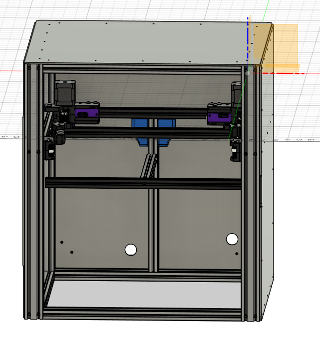

My 300mm trident is a 300x300x250 CoreXY printer primarily featuring components from other projects:

* [Monolith 2wd gantry](https://github.com/CloakedWayne/Monolith_Gantry_V2-VT)
* [Archetype Mjolnir toolhead](https://github.com/Armchair-Heavy-Industries/Archetype/tree/main/Archetype%20-%20Mjolnir)
* [Voron Trident bed](https://github.com/VoronDesign/Voron-Trident)
* 4040/2020 frame members
* Aluminum structural panels
* [Annex engineering k3 backpack](https://github.com/Annex-Engineering/Gasherbrum-K3)
* [Clickyclacky_door](https://github.com/tanaes/whopping_Voron_mods/tree/main/clickyclacky_door)
* Dual PSUs for mixed 24V and 48V components
* Dual SSRs for optional chamber heating

## CAD

* CAD drawings for original design elements are included in [CAD/Voron_300mm.zip](CAD/Base/Voron_300mm.zip).
* Monolith and Archetype components can be found in their respective repositories.
